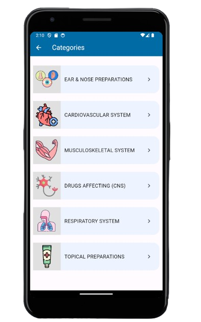

# Drug Mobile App

## Description
This is a Flutter mobile application designed for doctors and pharmacists to manage drug information, prescriptions, and medical references.

## Features
- **Drugs**: Navigate through categories, search, and view detailed drug information.
- **Reference**: Information and abbreviations for medical terms.
- **Prescription**: Submit and delete prescriptions for patients.
- **Add Drug**: Doctors can add new drugs to the database.
- **User Registration**: Users can register and log in.
  
## Tech Stack
- Flutter
- Dart
- Firebase
  
## Future Features
- Registration for doctors and patients.
- Barcode scanning for drug search.
- Notifications for prescriptions.


### Installation
1. Clone the repository:
   ```bash
   git clone https://github.com/MariamHammouda/Drug_Mobile_App.git
## Screenshots





## Demo video
[Click here to watch the demo video](https://github.com/your-username/repo-name/blob/main/path-to-video.mp4)

